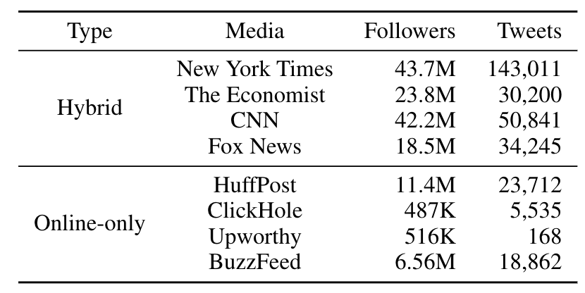

# News-Tweet Paired Dataset (NTPair)

This repository consists of (1) a news-tweet paired dataset and (2) an analysis tool for measuring the effects of a style change for news sharing on social media engagement. 
For more details, please refer to the preprint titled "[Understanding Effects of Editing Tweets for News Sharing by Media Accounts through a Causal Inference Framework](https://NA)."

If you are using the dataset or the analysis tool, please cite our ICWSM-21 version of this paper.
```
@inproceedings{park2021news,
  title={Understanding Effects of Editing Tweets for News Sharing by Media Accounts through a Causal Inference Framework},
  author={Park, Kunwoo and Kwak, Haewoon and An, Jisun and Chawla, Sanjay},
  booktitle={Proceedings of the International AAAI Conference on Web and Social Media},
  year={2021}
}
```


## Dataset Information

The consists of the pairs of news articles and their corresponding tweets that were published by eight media outlets in 2018. The eight outlets were selected to consider diverse outlets, which employ a different editing style for news sharing, in terms of publishing channels and political leaning.



While all paired tweets and news articles were collected and analyzed, we have decided to **only release news headlines and tweet ids** due to the related copyright issues. Using [the Twitter official API](https://developer.twitter.com/en/products/twitter-api) or other third-party collection tools (e.g., [Twint](https://github.com/twintproject/twint)), one could reconstruct the entire dataset easily.

For various usages, the dataset also includes a 300-dimensonal fastText embedding vector for representing the main text of a news article. 

Below is an example of the dataset:
```
tweet_id, headline, bodytext_feature
1060538143068299264,Supreme Court Justice Ruth Bader Ginsburg fractures 3 ribs in fall,"[-2.43365043e-03 -1.44351162e-02 ...]"
```

The dataset is available at [Havard Dataverse](https://doi.org/10.7910/DVN/SUHOKZ).


## Computational Framework

*TBD*
